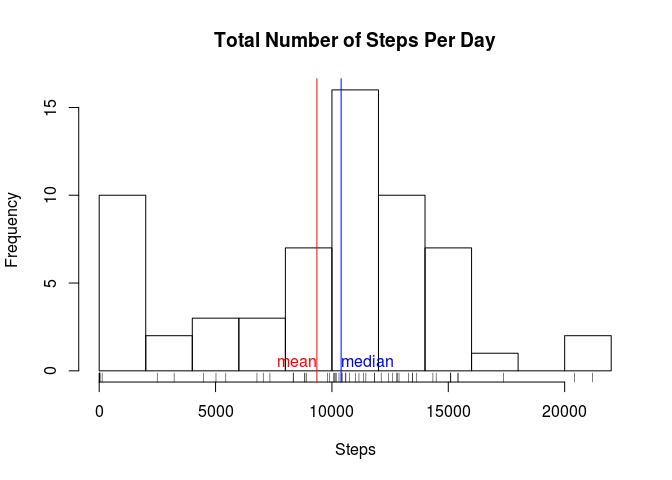
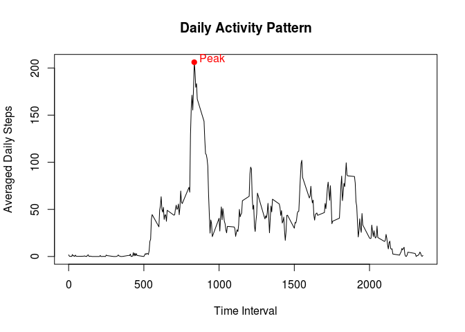
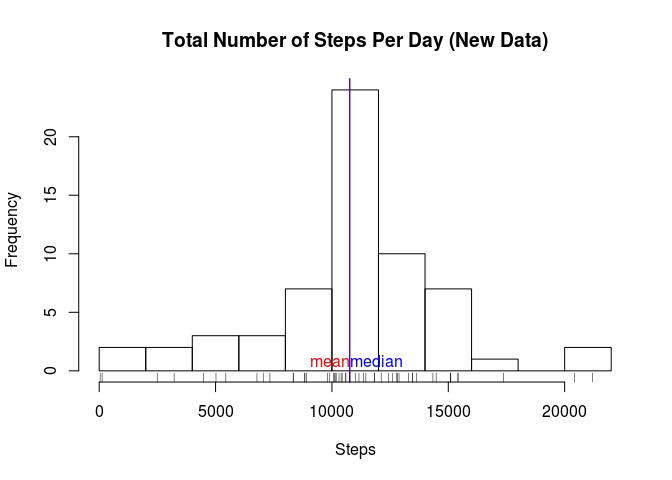

# Reproducible Research: Peer Assessment 1


## Loading and preprocessing the data

```r
activity <- read.csv("activity.csv", stringsAsFactors = FALSE)
activity$date <- as.Date(activity$date, "%Y-%m-%d")
head(activity)
```

```
##   steps       date interval
## 1    NA 2012-10-01        0
## 2    NA 2012-10-01        5
## 3    NA 2012-10-01       10
## 4    NA 2012-10-01       15
## 5    NA 2012-10-01       20
## 6    NA 2012-10-01       25
```

## What is mean total number of steps taken per day?
* Summarize the number of steps taken by day

```r
totalStepPerDay <- tapply(activity$step, activity$date, sum, na.rm = TRUE)
length(totalStepPerDay)
```

```
## [1] 61
```

```r
head(totalStepPerDay)
```

```
## 2012-10-01 2012-10-02 2012-10-03 2012-10-04 2012-10-05 2012-10-06 
##          0        126      11352      12116      13294      15420
```
* Make a histogram of the total number of steps taken each day

```r
hist(totalStepPerDay, breaks = 15, xlab = "Steps", main = "Total Number of Steps Per Day")
rug(totalStepPerDay)
abline(v = mean(totalStepPerDay), col = "red")
abline(v = median(totalStepPerDay), col = "blue")
text(mean(totalStepPerDay),0, "mean", col = "red", adj = c(1.,-0.3))
text(median(totalStepPerDay),0, "median", col = "blue", adj = c(0.,-0.3))
```

<!-- -->

* Calculate and report the mean and median total number of steps taken per day

```r
sprintf("The data mean is %8.4f", mean(totalStepPerDay))
```

```
## [1] "The data mean is 9354.2295"
```

```r
sprintf("The data median is %8.4f", median(totalStepPerDay))
```

```
## [1] "The data median is 10395.0000"
```

## What is the average daily activity pattern?
* Make a time series plot (i.e. type = "l") of the 5-minute interval (x-axis) 
and the average number of steps taken, averaged across all days (y-axis)


```r
aveStepPerInterval <- tapply(activity$step, activity$interval, mean, na.rm = TRUE)
maxpt <- which.max(aveStepPerInterval)

plot(names(aveStepPerInterval), aveStepPerInterval, type = 'l', xlab = "Time Interval", ylab = "Averaged Daily Steps", main = "Daily Activity Pattern")
points(names(maxpt), aveStepPerInterval[maxpt[[1]]], pch = 19, col = "red")
text(as.numeric(names(maxpt)), aveStepPerInterval[[maxpt[[1]]]], "Peak", adj = c(-0.2, 0), col = "red")
```

<!-- -->

* Which 5-minute interval, on average across all the days in the dataset, 
contains the maximum number of steps?


```r
sprintf("The %s interval contains %8.4f, the maximum number of steps", names(maxpt), aveStepPerInterval[[maxpt[[1]]]])
```

```
## [1] "The 835 interval contains 206.1698, the maximum number of steps"
```

## Imputing missing values
* Calculate and report the total number of missing values in the dataset 
(i.e. the total number of rows with NAs)


```r
missingIdx <- is.na(activity$steps)
sprintf("In total, %d of rows have missing value in steps", sum(missingIdx))
```

```
## [1] "In total, 2304 of rows have missing value in steps"
```
* Devise a strategy for filling in all of the missing values in the dataset. The
strategy does not need to be sophisticated. For example, you could use
the mean/median for that day, or the mean for that 5-minute interval, etc.

* Create a new dataset that is equal to the original dataset but with the
missing data filled in.


```r
newdata <- activity
newdata$steps[missingIdx] <- unname(aveStepPerInterval[as.character(newdata[missingIdx,3])])
```

* Make a histogram of the total number of steps taken each day and Calculate
and report the mean and median total number of steps taken per day. 


```r
newTotalStepPerDay <- tapply(newdata$step, newdata$date, sum)
hist(newTotalStepPerDay, breaks = 15, xlab = "Steps", main = "Total Number of Steps Per Day (New Data)")
rug(newTotalStepPerDay)
abline(v = mean(newTotalStepPerDay), col = "red")
abline(v = median(newTotalStepPerDay), col = "blue")
text(mean(newTotalStepPerDay),0, "mean", col = "red", adj = c(1.,-0.3))
text(median(newTotalStepPerDay),0, "median", col = "blue", adj = c(0.,-0.3))
```

<!-- -->

```r
sprintf("The new data mean is %8.4f", mean(newTotalStepPerDay))
```

```
## [1] "The new data mean is 10766.1887"
```

```r
sprintf("The new data median is %8.4f", median(newTotalStepPerDay))
```

```
## [1] "The new data median is 10766.1887"
```

* Do these values differ from the estimates from the first part of the assignment?
```
Yes.
```
* What is the impact of imputing missing data on the estimates of the total
daily number of steps?
```
It increases both the mean and median and makes the mean identical to the median.
```

## Are there differences in activity patterns between weekdays and weekends?
* Create a new factor variable in the dataset with two levels – “weekday”
and “weekend” indicating whether a given date is a weekday or weekend
day.

```r
newdata$datetype <- factor(ifelse(weekdays(newdata$date) 
                                  %in% c("Saturday", "Sunday"), "weekend", "weekday"))
newAveData <- aggregate(newdata$steps, by = list(newdata$interval, newdata$datetype),mean)
names(newAveData) <- c("interval", "datetype", "steps")
```
* Make a panel plot containing a time series plot (i.e. type = "l") of the
5-minute interval (x-axis) and the average number of steps taken, averaged
across all weekday days or weekend days (y-axis). 

```r
library(lattice)
with(newAveData, xyplot(steps~interval|datetype, type='l',layout=c(1,2), xlab="Interval",ylab="Number of Steps"))
```

<!-- -->
